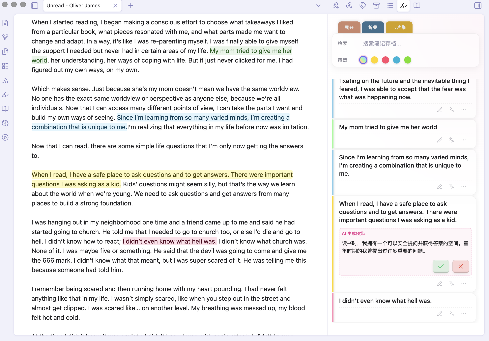
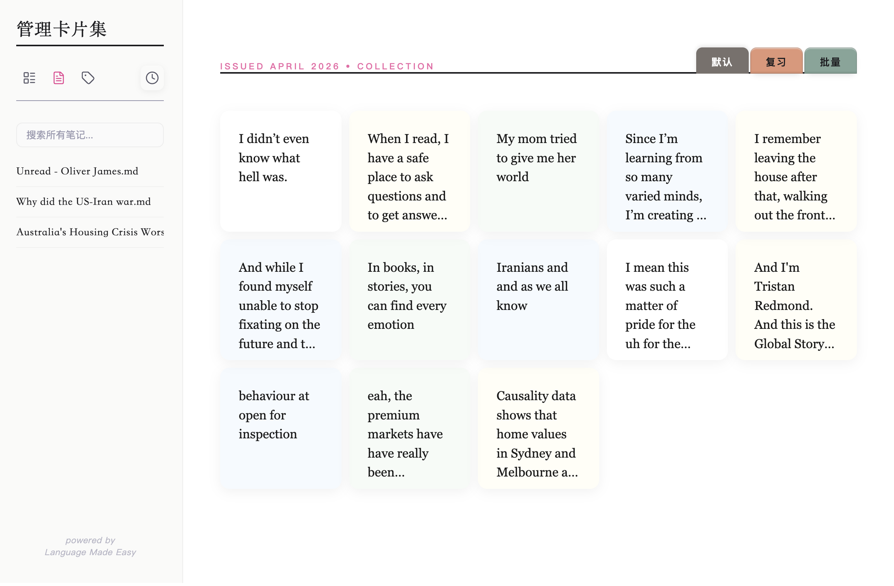

# HiLighter - Obsidian Highlight Note Management Tool

**HiLighter** is an Obsidian plugin focused on highlight note management. It transforms highlighted content into manageable note cards with support for multiple color annotations, AI-powered analysis, and intelligent search features, making your note organization more efficient. [中文](./README_ZH.md)

---

## ✨ Core Features

### 🎨 Highlight Note Cards Management
*   **Sidebar Management**: Aggregates `<mark>` highlighted content from current document or entire library, supporting **instant navigation** to original text via card click.
*   **Multi-Dimensional Filtering**:
    *   **Color Filter**: Quick categorization by four highlight colors: yellow, pink, blue, and green.
    *   **Keyword Search**: Real-time filtering of note content via top search bar.
*   **AI-Powered Intelligence**:
    *   **AI Translation (Languages)**: One-click precise translation of highlighted sentences.
    *   **AI Research (Microscope)**: Comes with multiple built-in research prompt templates (philosophical analysis, concise summary, critical analysis) and supports **custom research prompts** — freely add, edit, and switch between prompts to suit different deep reading scenarios.
*   **Flexible Interaction**:
    *   **Quick Edit**: Click pencil icon to directly edit notes on cards with auto-adjusting height.
    *   **Tag System**: Support for custom tags with built-in intelligent recommendation algorithm.
    *   **Card Collection Navigation**: One-click switch to full-screen "Card Studio" mode for centralized inspiration management.
*   **Note Card Management**:
    *   **Locate Original Text**: Click a card to instantly jump to the highlighted position in the source note for quick context recovery.
    *   **Classification Tags**: Add tags to each card for organized categorization, with support for batch tag operations.
    *   **Batch Deletion**: Enter batch mode to multi-select cards and delete them in one click for efficient cleanup.
    *   **Review Mode**: Shuffle cards randomly for review and consolidation, with an archive option for mastered content.

---

## 🚀 Quick Start

### Installation
1. **Manual Installation (Recommended):**
    *   Obtain the latest version's three main files: `main.js`, `manifest.json`, and `styles.css`.
    *   Place them in your vault folder: `.obsidian/plugins/hilighter/`.
    *   Enable the plugin in Settings > Third-party plugins.
2. **Community Plugins (Coming Soon):** Search for `HiLighter` in the Obsidian Community Plugins market and install.

### Basic Configuration
1.  **AI LLM API (Important)**: To use AI Translation and AI Research features, configure an AI LLM API in plugin settings. Supports mainstream providers including DeepSeek, Google Gemini, and Volcano Engine (Ark).
2.  **Ribbon Icon**: You can control whether to display the sidebar highlight notes icon in settings.

---

## 🛠 Development & Build

Developers are welcome to contribute to improving this project!

*   **Requirements**: NodeJS (v16+)
*   **Install Dependencies**: `npm install`
*   **Development Mode**: `npm run dev`
*   **Production Build**: `npm run build`

---

## ❤️ Support & Feedback

If you enjoy this plugin, you can show your support through:

*   **Follow Official Account**: 潘多拉的数字花园 (Pandora's Digital Garden)
*   **Multi-Platform Support**: Also available on Weibo, Xiaohongshu (Little Red Book), and Knowledge Planet under the same name
*   **Contact & Feedback**: Feel free to add VX: **PandoraReads**

---

*"Let highlighted notes become the catalyst for inspiration." — HiLighter*
